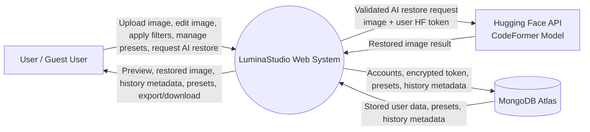
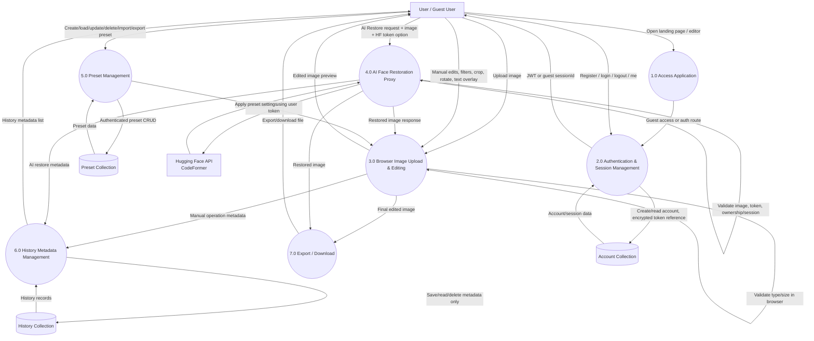
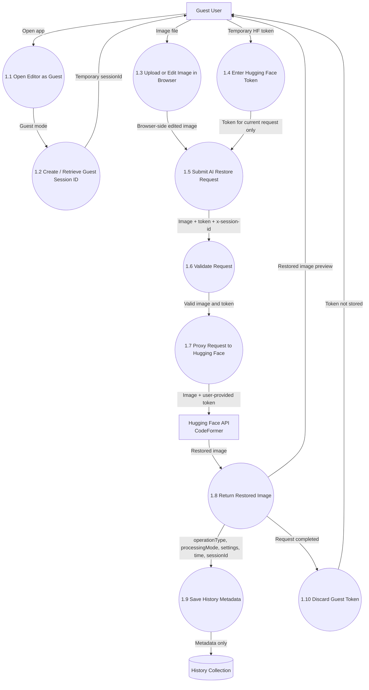
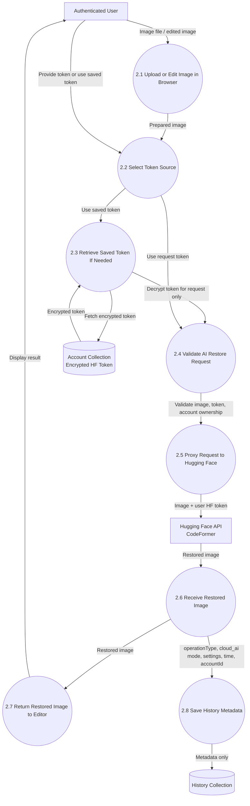
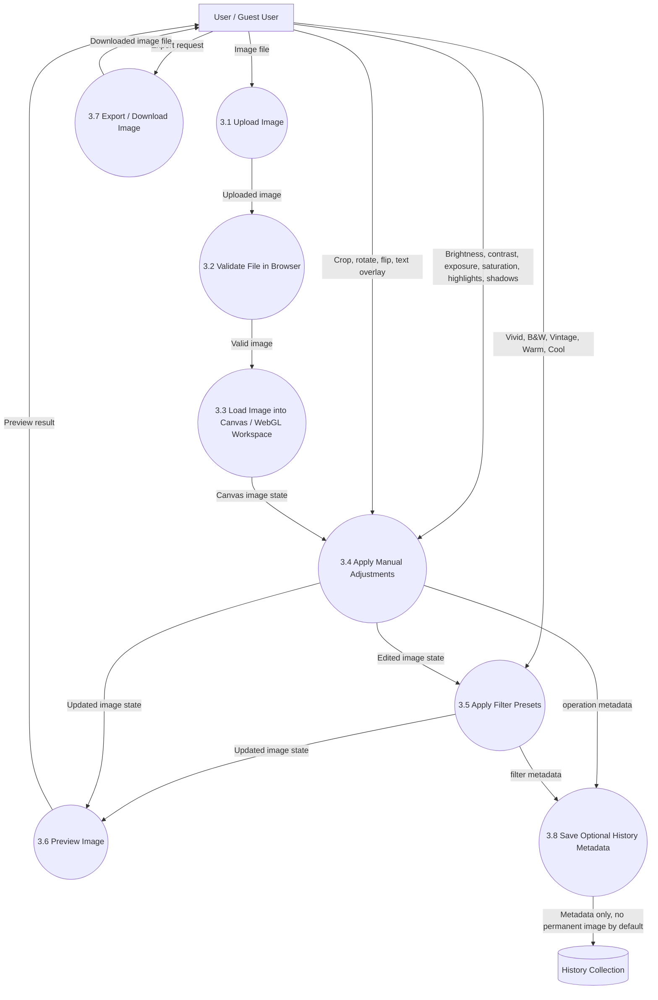
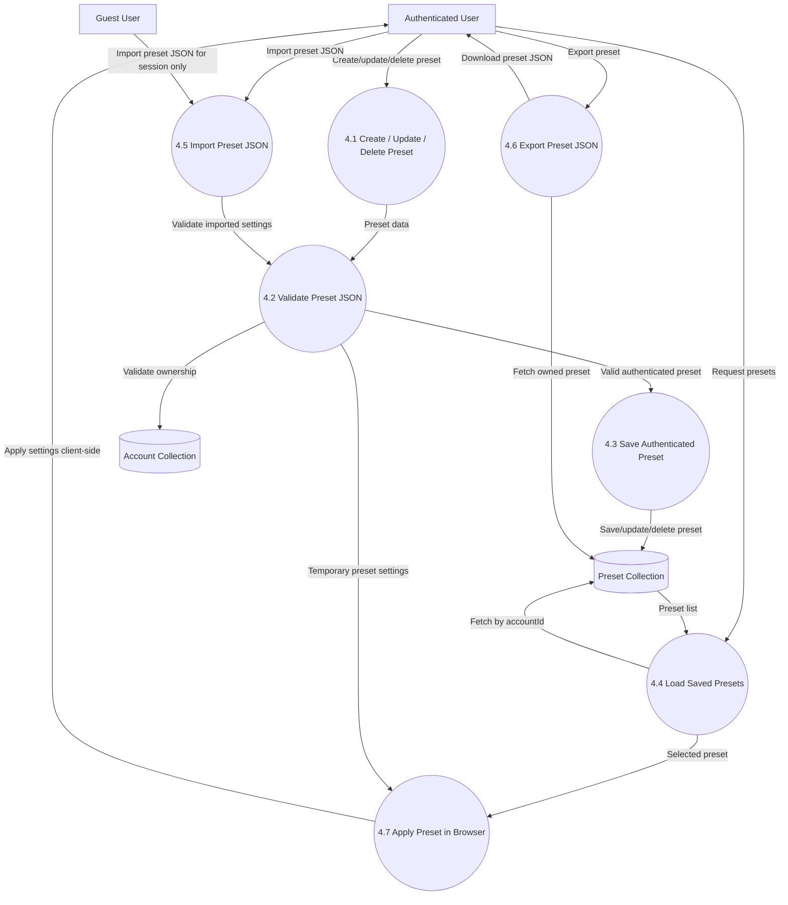
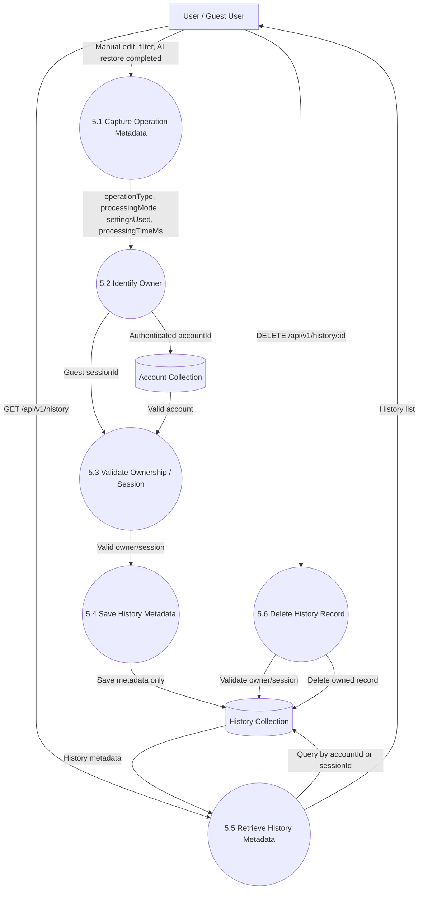

# LuminaStudio Web DFDs

## 1. DFD Level 0 - Context Diagram

---

## 2. DFD Level 1 - Main Web Application Flow

---

## 3. DFD Level 2 - Guest AI Face Restoration

---

## 4. DFD Level 2 - Authenticated AI Face Restoration

---

## 5. DFD Level 2 - Browser Manual Editing & Filters

---

## 6. DFD Level 2 - Preset Management

---

## 7. DFD Level 2 - History Metadata Management

