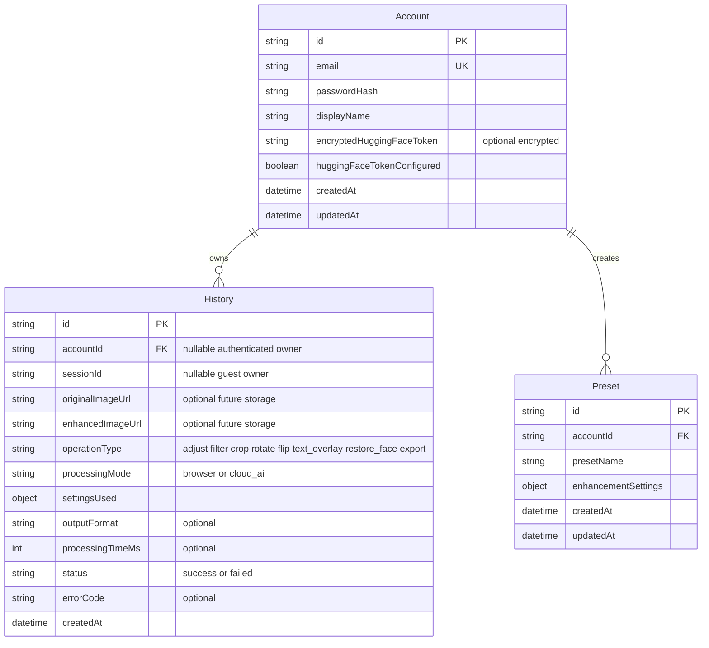

# Lumina Studio Entity Relationship Design

```mermaid
erDiagram
    Account {
        string id PK
        string email UK
        string passwordHash
        string displayName
        string encryptedHuggingFaceToken "optional encrypted"
        boolean huggingFaceTokenConfigured
        datetime createdAt
        datetime updatedAt
    }

    History {
        string id PK
        string accountId FK "nullable authenticated owner"
        string sessionId "nullable guest owner"
        string originalImageUrl "optional future storage"
        string enhancedImageUrl "optional future storage"
        string operationType "adjust filter crop rotate flip text_overlay restore_face export"
        string processingMode "browser or cloud_ai"
        object settingsUsed
        string outputFormat "optional"
        int processingTimeMs "optional"
        string status "success or failed"
        string errorCode "optional"
        datetime createdAt
    }

    Preset {
        string id PK
        string accountId FK
        string presetName
        object enhancementSettings
        datetime createdAt
        datetime updatedAt
    }

    Account ||--o{ History : owns
    Account ||--o{ Preset : creates
```
