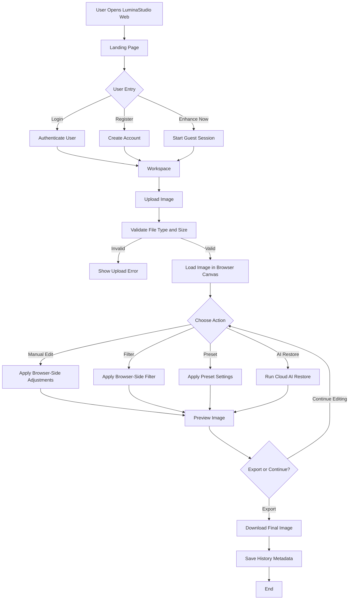
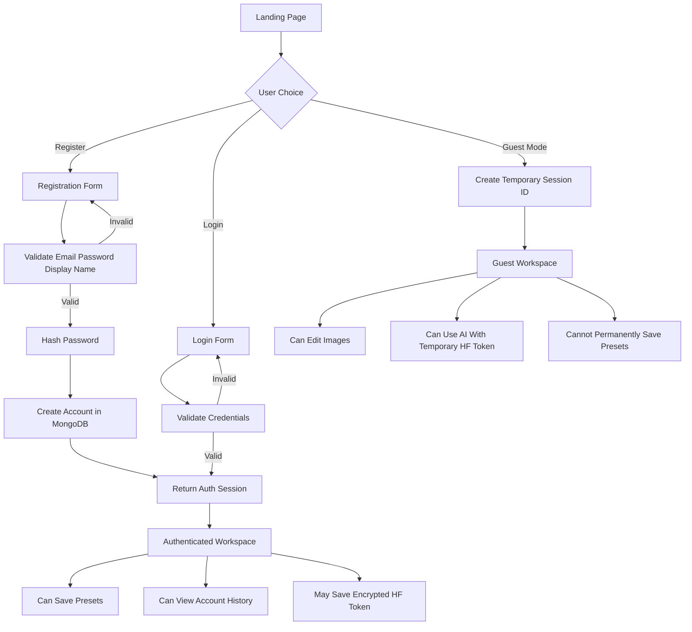
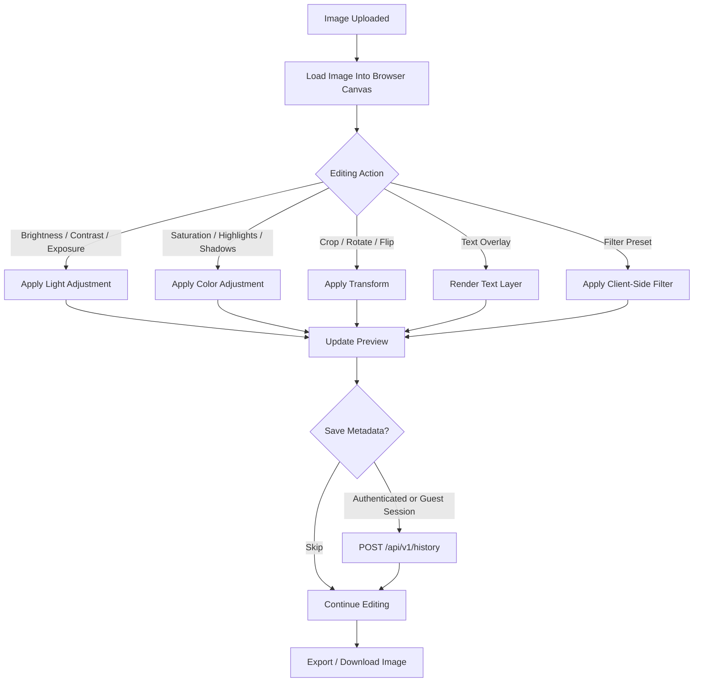
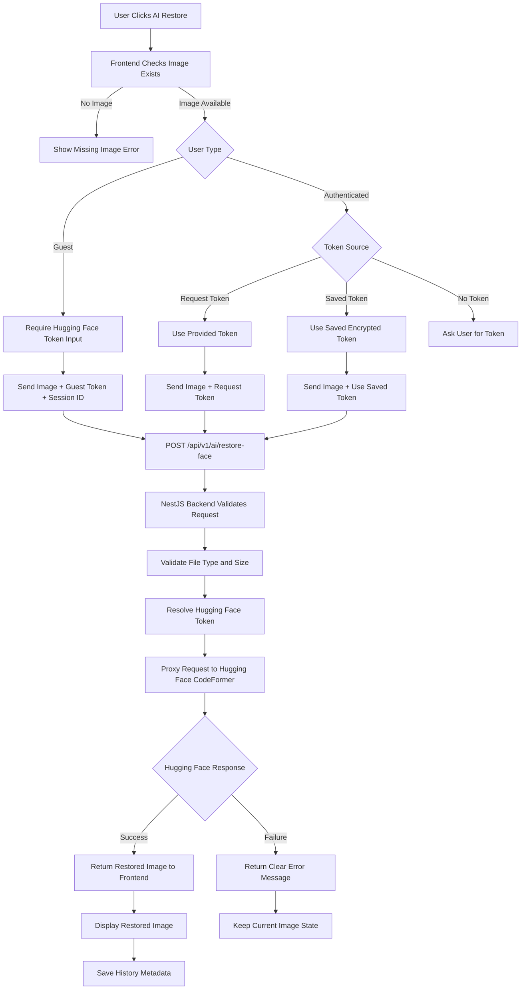
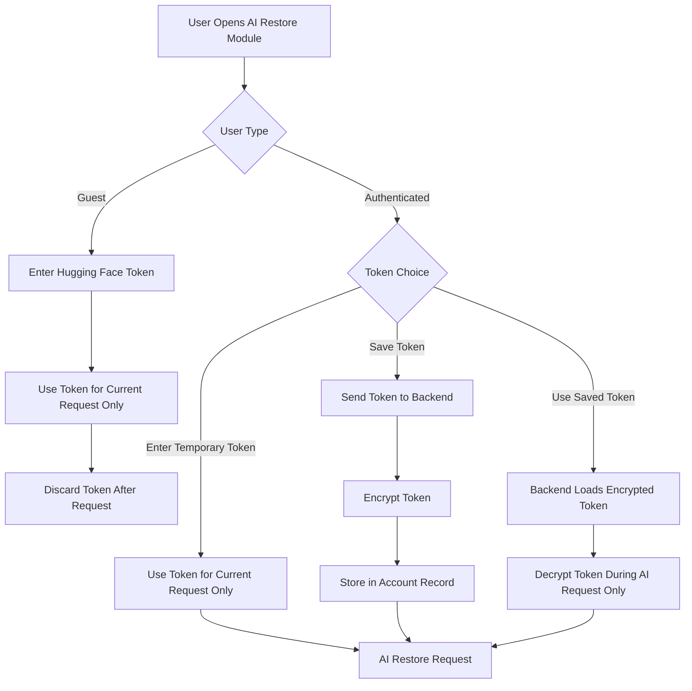
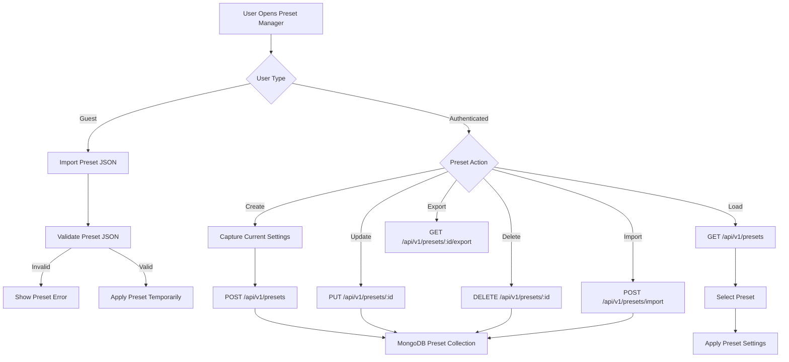
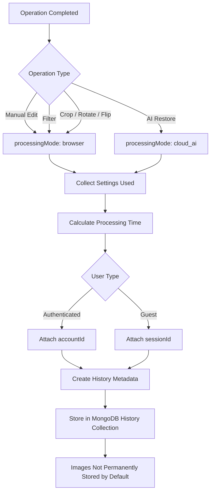
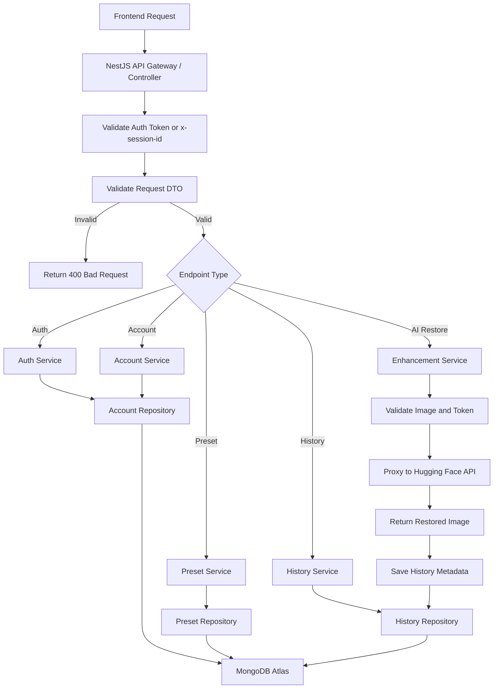
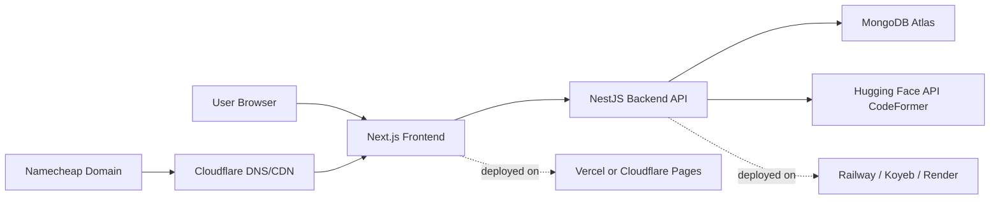

# Lumina Studio Flowcharts 

# 1. Overall Web App Flow

---

# 2. Authentication and Guest Access Flow

---

# 3. Browser Editing Flow

---

# 4. AI Face Restoration Flow

---

# 5. Hugging Face Token Flow

---

# 6. Preset Management Flow

---

# 7. History Metadata Flow

---

# 8. Backend Request Flow

---

# 9. Deployment Flow

