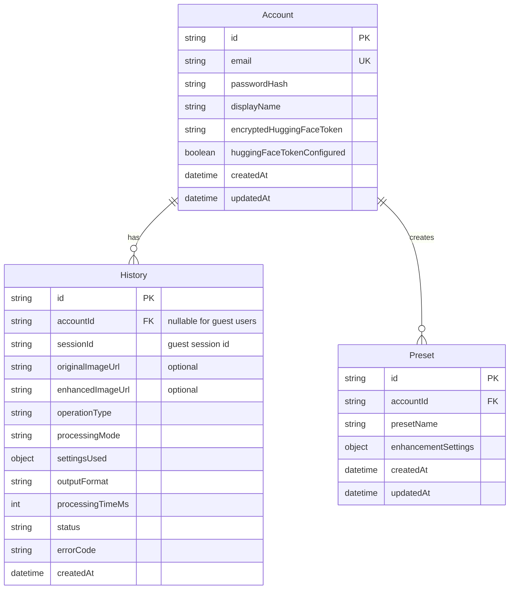

# LuminaStudio Web Technical Design Document

## 1. System Overview

LuminaStudio Web is a browser-based photo enhancement and filtering application. It allows users to upload images, apply manual image adjustments, use filter presets, and perform AI-powered face restoration through the Hugging Face API using the CodeFormer model.

This document focuses only on the web application. Offline AI processing, local CodeFormer execution, local Real-ESRGAN execution, and Electron desktop functionality are excluded from this TDD and will be handled in a separate LuminaStudio Desktop technical design document.

LuminaStudio Web is designed for free-tier-friendly deployment. Manual image editing and filtering are handled in the browser, while AI restoration is performed through Hugging Face using a Hugging Face API token provided by the user.

---

## 2. Product Scope

### 2.1 Included in the Web App

- Marketing landing page
- Guest access
- Account registration and login
- Browser-based image upload
- Browser-based manual image editing
- Browser-based filter presets
- AI face restoration using Hugging Face API and CodeFormer
- User-provided Hugging Face API token support
- Preset management for authenticated users
- Basic history metadata
- Image preview and export/download

### 2.2 Excluded from the Web App

- Offline AI processing
- Local CodeFormer execution
- Local Real-ESRGAN execution
- Server-side GPU processing
- Server-side manual image enhancement processing
- Desktop file-system integration
- Native binary execution
- Batch image processing
- Permanent image storage by default

---

## 3. Technology Stack

### 3.1 Frontend

- Next.js
- React
- TypeScript
- Hybrid UI from Figma Make Prototype 
- Browser Canvas API or WebGL-based image editing

### 3.2 Backend

- NestJS
- Node.js
- REST API architecture

### 3.3 Database

- MongoDB
- Used for accounts, presets, encrypted token references, and history metadata
- Guest sessions are represented by temporary `sessionId` values in requests and history metadata for the MVP

### 3.4 AI Service

- Hugging Face API
- CodeFormer model for AI face restoration
- Hugging Face API token is always provided by the user

### 3.5 Deployment

- Frontend: Vercel or Cloudflare Pages
- Backend: Railway, Koyeb, Render, or another Node.js-compatible hosting platform
- Database: MongoDB Atlas free tier where possible
- DNS/CDN: Cloudflare free tier where possible
- Domain: Optional custom domain through Namecheap or another registrar

---

## 4. Architectural Direction

LuminaStudio Web follows a browser-first architecture.

Manual edits and filters are processed directly in the user's browser. The backend does not perform manual image enhancement, filtering, cropping, rotating, or offline AI processing. The backend is responsible for authentication, preset management, history metadata, request validation, token handling, and securely proxying AI restoration requests to Hugging Face.

The AI restoration process is cloud-based. Users must provide their own Hugging Face API token. For guest users, the token is provided temporarily during the restoration request. For authenticated users, the token may optionally be saved in encrypted form for future use.

```text
User Browser
    |
    | Next.js Frontend
    | Manual editing and filters run client-side
    |
    v
NestJS Backend
    |
    | Auth, presets, history metadata, validation
    |
    v
MongoDB Atlas

User Browser
    |
    | Image + user-provided Hugging Face token
    v
NestJS Backend
    |
    | Secure proxy request
    v
Hugging Face API
    |
    | CodeFormer model
    v
Restored image returned to frontend
```

---

## 5. Functional Requirements

### 5.1 Authentication

- Users shall be able to create an account using email and password.
- Users shall be able to log in using valid credentials.
- Users shall be able to log out.
- Users shall be able to access the application as guests.
- Authenticated users shall be able to save presets.
- Authenticated users shall be able to view their own history metadata.
- Authenticated users may optionally save an encrypted Hugging Face API token.

### 5.2 Guest Mode

- Guest users shall be able to access the editor without registration.
- Guest users shall be identified through a temporary session ID.
- Guest users shall be able to use AI restoration by providing a Hugging Face API token.
- Guest-provided Hugging Face tokens shall not be stored permanently.
- Guest users shall not be able to permanently save account-based presets.

### 5.3 Image Upload

- Users shall be able to upload supported image formats.
- The system shall validate the file type before AI restoration.
- The system shall validate the file size before AI restoration.
- The frontend may resize or compress images before sending them for AI restoration.

### 5.4 Manual Editing

Users shall be able to apply browser-side adjustments including:

- Brightness
- Contrast
- Exposure
- Saturation
- Highlights
- Shadows
- Crop
- Rotate
- Flip
- Text overlay

Manual editing shall be performed in the browser and shall not require a backend enhancement endpoint.

### 5.5 Filters

Users shall be able to apply predefined browser-side filters including:

- Vivid
- Black and White
- Vintage
- Warm
- Cool

Filters shall be applied client-side and shall not require a backend enhancement endpoint.

### 5.6 AI Face Restoration

Users shall be able to restore faces in an image using Hugging Face CodeFormer.

The AI restoration flow shall be:

1. User uploads or edits an image.
2. User provides a Hugging Face API token.
3. User clicks AI Restore.
4. Frontend sends the image and token to the NestJS backend.
5. Backend validates the request.
6. Backend forwards the image to Hugging Face using the user's token.
7. Hugging Face processes the image using CodeFormer.
8. Backend receives the restored image.
9. Backend returns the restored image to the frontend.
10. Frontend displays the restored image in the editor.

### 5.7 Preset Management

Authenticated users shall be able to:

- Create presets.
- Load saved presets.
- Update presets.
- Delete presets.
- Import preset JSON files.
- Export preset JSON files.

Guest users may import and apply preset JSON files during the active session, but guest presets shall not be saved permanently.

### 5.8 History Management

The system shall record metadata about user operations.

History records may include:

- Operation type
- Processing mode
- Settings used
- Processing time
- Creation timestamp

For browser-side edits and filters, the frontend may call the history endpoint only to save metadata. The backend shall not process the edited image.

For the MVP, image files shall not be permanently stored by default.

---

## 6. Non-Functional Requirements

### 6.1 Performance

- Manual edits and filters should run in the browser.
- Backend image processing should be avoided.
- AI restoration requests should use compressed or size-limited images.
- The frontend should show loading states during AI processing.
- Large image uploads should be rejected or resized before being sent to the backend.

### 6.2 Reliability

- Failed AI requests should return clear error messages.
- The app should remain usable even if Hugging Face is unavailable.
- Manual editing and filters should work independently from AI restoration.
- The frontend should not lose the current image state if AI restoration fails.

### 6.3 Security

- Passwords must be hashed before storage.
- Hugging Face tokens must not be exposed to other users.
- Guest Hugging Face tokens must not be stored permanently.
- Saved Hugging Face tokens must be encrypted before being stored.
- Backend endpoints must validate file type and file size for AI restoration requests.
- Users must only access their own presets and history.

### 6.4 Cost Control

- LuminaStudio shall not use a platform-owned Hugging Face API token by default.
- AI restoration shall rely on the user's own Hugging Face API token.
- Large image uploads must be restricted.
- Permanent image storage should be avoided in the MVP.
- Manual editing and filters should remain browser-side to reduce backend cost.

---

## 7. Database Schema Design

The database contains the following primary collections:

1. Account
2. History
3. Preset

Optional future collections may be added for audit logs, temporary sessions, or persistent image storage metadata.

---

### 7.1 Account Collection

Stores authenticated user information and optional encrypted Hugging Face credentials.

| Field | Type | Constraint | Description |
|---|---|---|---|
| id | string | Primary Key | Unique account identifier |
| email | string | Unique Key | User email address |
| passwordHash | string | Required | Hashed user password |
| displayName | string | Required | User display name |
| encryptedHuggingFaceToken | string | Optional | Encrypted user-provided Hugging Face API token |
| huggingFaceTokenConfigured | boolean | Required | Safe flag indicating whether a saved token exists |
| createdAt | datetime | Required | Account creation timestamp |
| updatedAt | datetime | Required | Last account update timestamp |

Notes:

- `encryptedHuggingFaceToken` is optional.
- `huggingFaceTokenConfigured` is returned to the frontend instead of the token value.
- If saved, the token must be encrypted before storage.
- Guest users do not create Account records.

---

### 7.2 History Collection

Stores operation metadata for authenticated and guest users.

| Field | Type | Constraint | Description |
|---|---|---|---|
| id | string | Primary Key | Unique history record identifier |
| accountId | string | Nullable Foreign Key | References Account.id for authenticated users |
| sessionId | string | Nullable | Temporary guest session identifier |
| originalImageUrl | string | Optional | URL of original image, if stored in future object storage |
| enhancedImageUrl | string | Optional | URL of restored image, if stored in future object storage |
| operationType | string | Required | Operation performed: adjust, filter, crop, rotate, flip, text_overlay, restore_face, or export |
| processingMode | string | Required | browser or cloud_ai |
| settingsUsed | object | Optional | Settings used during the operation |
| outputFormat | string | Optional | Export or AI output format |
| processingTimeMs | int | Optional | Processing duration in milliseconds |
| status | string | Required | success or failed |
| errorCode | string | Optional | Error code if operation failed |
| createdAt | datetime | Required | History record creation timestamp |

Notes:

- For authenticated users, `accountId` is used.
- For guest users, `sessionId` is used.
- `originalImageUrl` and `enhancedImageUrl` are optional because permanent image storage is not part of the MVP.
- Browser-side edit history records are metadata-only records.

---

### 7.3 Preset Collection

Stores reusable adjustment configurations for authenticated users.

| Field | Type | Constraint | Description |
|---|---|---|---|
| id | string | Primary Key | Unique preset identifier |
| accountId | string | Foreign Key | References Account.id |
| presetName | string | Required | User-defined preset name |
| enhancementSettings | object | Required | Browser-side adjustment and filter settings |
| createdAt | datetime | Required | Preset creation timestamp |
| updatedAt | datetime | Required | Last preset update timestamp |

Notes:

- Presets are scoped to authenticated accounts only.
- Guest users may import and apply presets temporarily but cannot persist them to the database.

---

## 8. Entity Relationship Diagram



---

## 9. API Design

All API endpoints are versioned under `/api/v1`.

### 9.1 Authentication Endpoints

#### POST `/api/v1/auth/register`

Creates a new user account.

Responsibilities:

- Validate email, password, and display name.
- Hash the password.
- Create an Account record.
- Return authenticated user session data.

#### POST `/api/v1/auth/login`

Authenticates an existing user.

Responsibilities:

- Validate credentials.
- Compare password with stored hash.
- Create authenticated session or token.
- Return current user data.

#### POST `/api/v1/auth/logout`

Logs out the current user.

#### GET `/api/v1/auth/me`

Returns the currently authenticated user.

---

### 9.2 Hugging Face Token Endpoints

#### PUT `/api/v1/account/hugging-face-token`

Stores or updates the authenticated user's Hugging Face API token.

Responsibilities:

- Require authentication.
- Validate token format if possible.
- Encrypt the token before storage.
- Save encrypted token to `Account.encryptedHuggingFaceToken`.
- Set `Account.huggingFaceTokenConfigured` for safe frontend display.

#### DELETE `/api/v1/account/hugging-face-token`

Deletes the authenticated user's saved Hugging Face API token.

---

### 9.3 AI Restoration Endpoint

#### POST `/api/v1/ai/restore-face`

Restores faces in an uploaded image using Hugging Face CodeFormer.

Responsibilities:

- Validate uploaded image.
- Validate file type.
- Validate file size.
- Determine whether the request is from an authenticated user or guest user.
- Use the provided Hugging Face token from the request, or the authenticated user's saved encrypted token if no request token is provided.
- Forward the image to Hugging Face.
- Receive the restored image.
- Return the restored image to the frontend.
- Save history metadata.

Token behavior:

- Guest users must provide a Hugging Face token with the request.
- Authenticated users may provide a token with the request or use their saved encrypted token.
- Request-provided tokens are used only for the active request unless explicitly saved by an authenticated user.

Important API boundary:

- The Web MVP shall not include `POST /api/v1/enhance/offline`.
- The Web MVP shall not include `POST /api/v1/enhance/manual`.
- Browser-side manual edits and filters may save operation metadata through `POST /api/v1/history`.

---

### 9.4 Preset Endpoints

#### GET `/api/v1/presets`

Returns all presets owned by the authenticated user.

#### POST `/api/v1/presets`

Creates a new preset.

#### PUT `/api/v1/presets/:id`

Updates an existing preset.

#### DELETE `/api/v1/presets/:id`

Deletes a preset.

#### POST `/api/v1/presets/import`

Validates and imports preset JSON.

#### GET `/api/v1/presets/:id/export`

Exports a preset as JSON.

---

### 9.5 History Endpoints

#### GET `/api/v1/history`

Returns history metadata for the authenticated user or current guest session.

#### POST `/api/v1/history`

Creates a history metadata record.

This endpoint may be used for:

- Browser-side manual adjustments
- Browser-side filters
- Crop, rotate, flip, or text overlay operations
- AI restoration metadata after `POST /api/v1/ai/restore-face`

This endpoint shall not process or enhance images.

#### DELETE `/api/v1/history/:id`

Deletes a history record owned by the current user.

---

## 10. AI Restoration Workflow

### 10.1 Guest AI Restoration

1. Guest user opens the web app.
2. System creates or retrieves a temporary guest `sessionId`.
3. Guest user uploads an image.
4. Guest user enters a Hugging Face API token.
5. Guest user clicks AI Restore.
6. Frontend sends the image, token, and session ID to `POST /api/v1/ai/restore-face`.
7. Backend validates the image and token presence.
8. Backend forwards the image to Hugging Face using the guest-provided token.
9. Hugging Face runs the CodeFormer model.
10. Hugging Face returns the restored image.
11. Backend returns the restored image to the frontend.
12. Frontend displays the result.
13. Backend records history metadata using `sessionId`.
14. Guest token is discarded after the request.

### 10.2 Authenticated AI Restoration

1. User logs in.
2. User uploads an image.
3. User either provides a Hugging Face token for the current request or uses a saved encrypted token.
4. User clicks AI Restore.
5. Frontend sends the image and token option to `POST /api/v1/ai/restore-face`.
6. Backend validates the image.
7. Backend decrypts the saved token if needed.
8. Backend forwards the image to Hugging Face using the user's token.
9. Hugging Face runs the CodeFormer model.
10. Hugging Face returns the restored image.
11. Backend returns the restored image to the frontend.
12. Frontend displays the restored result.
13. Backend records history metadata using `accountId`.

---

## 11. Browser Editing Workflow

1. User uploads an image.
2. Image is loaded into the browser workspace.
3. User applies manual adjustments or filters.
4. Changes are applied using browser-side processing.
5. User previews the result.
6. User exports the final image.
7. Frontend may call `POST /api/v1/history` to save metadata if the user is authenticated or has an active guest session.
8. Backend saves metadata only and does not process the image.

---

## 12. Image Processing Strategy

### 12.1 Client-Side Processing

The following operations are handled in the browser:

- Brightness
- Contrast
- Saturation
- Exposure
- Highlights
- Shadows
- Crop
- Rotate
- Flip
- Text overlay
- Filter presets
- Final export/download

### 12.2 Cloud AI Processing

AI face restoration is handled through Hugging Face CodeFormer.

The backend does not restore images directly. It only acts as a secure proxy between the frontend and Hugging Face.

The only backend AI enhancement endpoint for the Web MVP is:

```text
POST /api/v1/ai/restore-face
```

### 12.3 Image Storage Strategy

For the MVP:

- Images are processed in memory or temporarily during the request.
- Permanent image storage is avoided.
- History stores metadata only by default.
- `originalImageUrl` and `enhancedImageUrl` are reserved for future object storage integration.

Future versions may use Cloudflare R2 or another object storage provider for persistent image URLs.

---

## 13. User Interface Design

### 13.1 Landing Page

The landing page contains:

- Hero section
- Product overview
- Feature highlights
- AI restoration preview
- Sign In button
- Create Account button
- Enhance Now guest button

### 13.2 Authentication Pages

Authentication pages contain:

- Login form
- Registration form
- Validation messages

### 13.3 Main Workspace

The main workspace contains:

- Image upload area
- Main image canvas
- Before/After comparison toggle
- Export/download button
- Processing status indicator

### 13.4 Left Tool Panel

The left tool panel contains:

- Crop
- Rotate
- Flip
- Text tool

### 13.5 Bottom Filter Gallery

The bottom filter gallery contains:

- Vivid
- Black and White
- Vintage
- Warm
- Cool

### 13.6 Right Control Panel

The right control panel contains:

- AI Restore module
- Light adjustment controls
- Color adjustment controls
- Histogram display
- Preset manager

### 13.7 AI Restore Module

The AI Restore module contains:

- Hugging Face token input
- Save token option for authenticated users
- AI Restore button
- Processing status
- Error message display
- Reminder that the user must provide their own Hugging Face API token

### 13.8 Preset Manager

The Preset Manager contains:

- Saved preset dropdown
- Add preset button
- Update preset action
- Delete preset action
- Import preset action
- Export preset action

---

## 14. Security Design

### 14.1 Password Security

- Passwords are hashed before storage.
- Plain-text passwords are never stored.

### 14.2 Hugging Face Token Security

- Every AI restoration request must use a Hugging Face token provided by the user.
- Guest-provided tokens are used only for the active request and are not stored.
- Authenticated users may optionally save their Hugging Face token.
- Saved Hugging Face tokens are encrypted before storage.
- Saved tokens are decrypted only during AI restoration requests initiated by the token owner.
- Hugging Face tokens are never exposed to other users.
- Hugging Face tokens should not be logged.

### 14.3 Authorization

- Presets are scoped by `accountId`.
- History records are scoped by `accountId` or `sessionId`.
- Users cannot access records owned by another account.
- Guest users can only access records tied to their active session ID.

### 14.4 Upload Security

- Only supported image types are accepted for AI restoration requests.
- Maximum file size is enforced for AI restoration requests.
- Malformed image files are rejected.
- Backend does not permanently store uploaded images by default.

---

## 15. Error Handling

### 15.1 Upload Errors

- Unsupported file type
- File too large
- Corrupted image file
- Missing image file

### 15.2 Hugging Face Token Errors

- Missing token
- Invalid token
- Expired token
- Insufficient Hugging Face permissions
- Hugging Face quota exceeded

### 15.3 AI Restoration Errors

- Hugging Face API unavailable
- Hugging Face timeout
- Invalid AI response
- No detectable face
- Poor or unusable restoration result

### 15.4 Authentication Errors

- Invalid credentials
- Duplicate email
- Unauthorized request
- Expired session

### 15.5 Preset Errors

- Invalid preset JSON
- Missing preset fields
- Preset not found
- Unauthorized preset access

### 15.6 History Errors

- History record not found
- Unauthorized history access
- Missing account or session identifier

---

## 16. Deployment Strategy

### 16.1 Frontend Deployment

The Next.js frontend may be deployed using:

- Vercel
- Cloudflare Pages

### 16.2 Backend Deployment

The NestJS backend may be deployed using:

- Railway
- Koyeb
- Render
- Another Node.js-compatible hosting provider

### 16.3 Database Deployment

MongoDB Atlas will be used for hosted MongoDB.

### 16.4 Domain and DNS

The recommended setup is:

- Optional custom domain from Namecheap or another registrar
- Cloudflare DNS when a custom domain is used

### 16.5 Environment Variables

The backend requires:

```env
MONGODB_URI=
JWT_SECRET=
TOKEN_ENCRYPTION_KEY=
FRONTEND_URL=
MAX_UPLOAD_SIZE_MB=
```

Note: The backend does not require a platform-owned `HUGGING_FACE_API_KEY` because users provide their own Hugging Face API tokens.

The application can be deployed without a paid custom domain by using provider-generated URLs from Vercel, Cloudflare Pages, Render, Koyeb, Railway, or equivalent hosts. A Namecheap or other custom domain is optional and may require payment.

---

## 17. Future Enhancements

Future versions may include:

- Cloud image storage using Cloudflare R2
- Permanent image history
- Additional Hugging Face models
- AI upscaling
- Background removal
- Old photo colorization
- Public preset sharing
- Separate Electron desktop application
- Desktop offline mode using local CodeFormer or Real-ESRGAN
- Local AI model manager for desktop version

---

## 18. Web and Desktop Product Separation

LuminaStudio Web and LuminaStudio Desktop are separate applications.

### 18.1 LuminaStudio Web

Focused on:

- Browser accessibility
- Free-tier deployment
- Browser-side editing
- Hugging Face CodeFormer integration using user-provided API tokens

### 18.2 LuminaStudio Desktop

Planned separately for:

- Offline AI processing
- Local CodeFormer execution
- Local Real-ESRGAN execution
- Automatic or manual model downloads
- Local file-based workflows
- More advanced AI processing without depending on web hosting limits
